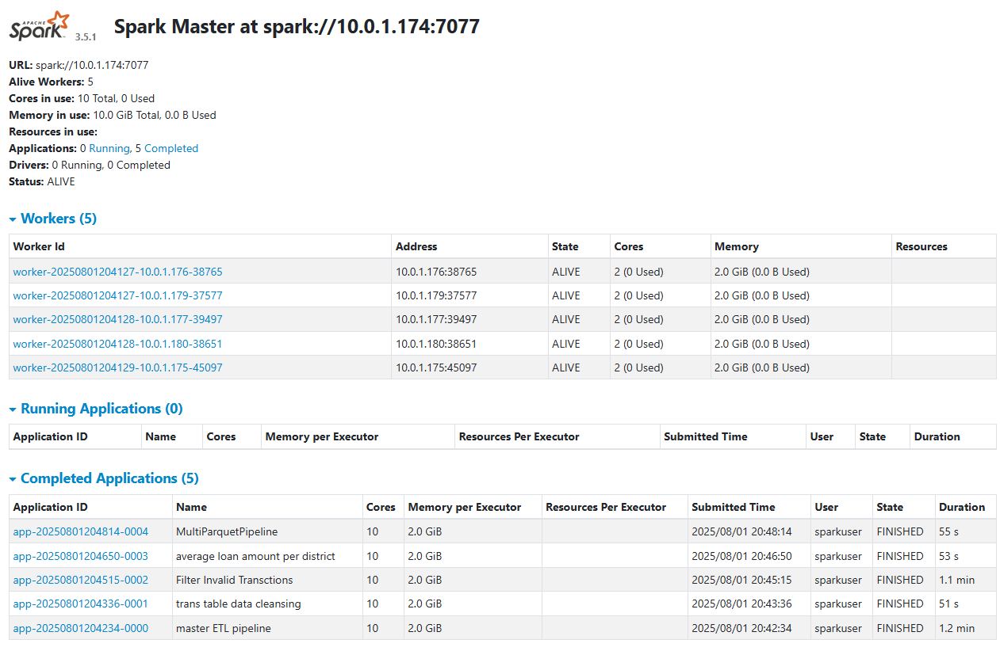
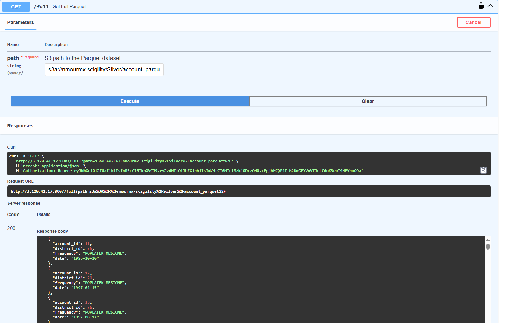
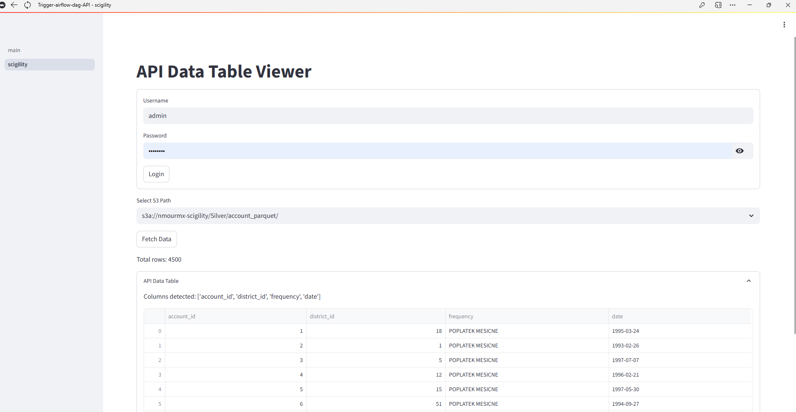
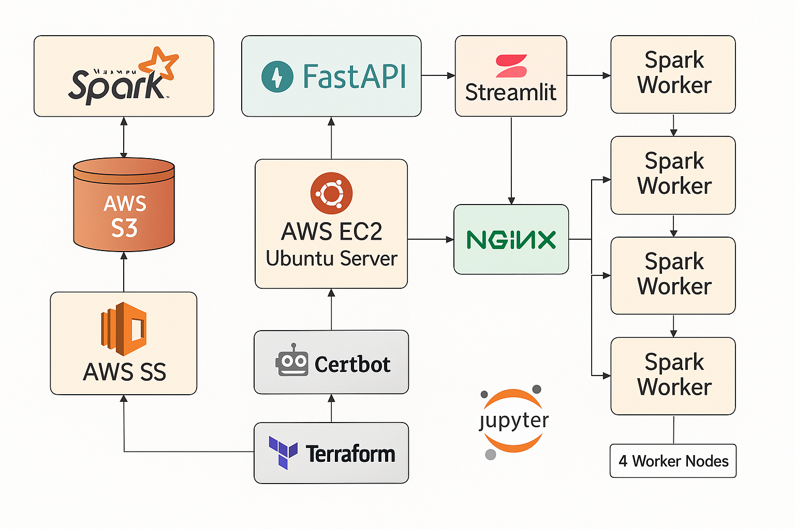

---

## Stack Overview

| Layer             | Tools/Services                                |
|------------------|------------------------------------------------|
| Data Processing   | Apache Spark, Parquet, Snappy Compression     |
| APIs              | FastAPI with JWT Authentication               |
| Dashboards        | Streamlit for interactive data visualization  |
| Infrastructure    | AWS EC2, S3, ECR, Route 53, Terraform         |
| Orchestration     | Docker Swarm                                  |
| Security          | Certbot (SSL), Firewalls, IAM Policies        |
| Testing           | Pytest                                        |

---

## Architecture Highlights

- **Two Spark Clusters**: One for ETL, one for analytics
- **Separation of Bronze, Silver, Gold layers**
- **Repartitioning, broadcast joins, and optimized shuffling**
- **Modular notebooks and pipelines**
- **Makefile automation for horizontal scaling**
- **Secure API with JWT and SSL**
- **Deployment via Terraform (S3, ECR, EC2)**

---

## Security

- JWT authentication on all API routes  
- Firewalls and role-based access via IAM  
- Predefined schema enforcement to avoid write errors  
- Snappy compression for efficient storage

---

## Testing

- API and data pipeline testing via **Pytest**
- Frontend/backend logic clearly separated for test isolation
- CI/CD compatibility ready

---

## Screenshots

### Spark Master UI – Cluster Overview


### FastAPI Swagger UI – API Documentation


### Streamlit UI – Interactive Visualization


### End-to-End Architecture Diagram


---

## Quick Start

### Prerequisites

- Docker & Docker Compose
- Terraform CLI
- AWS CLI (configured)
- Python 3.10+
- `make`

### Setup Instructions

```bash
# Clone the repo
git clone https://github.com/your-org/your-repo.git
cd your-repo

# Provision infrastructure
cd terraform
terraform init
terraform apply

# Build and push services
cd ..
make build
make deploy
